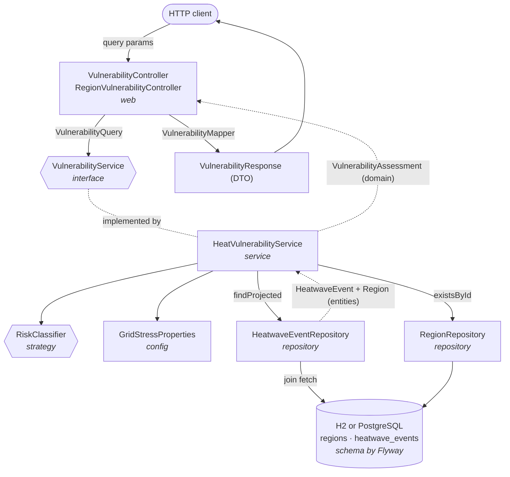

# ThermoGrid API

[](https://github.com/KoolAidKrish/ThermoGrid/actions/workflows/ci.yml)

A read-only Spring Boot service that answers one question: **which regions run out of power under projected heatwaves?**

**Stack:** Java 21 · Spring Boot 3.5 · Spring Data JPA · Flyway · H2 or PostgreSQL · springdoc-openapi · JUnit 5 + Mockito + Testcontainers · Maven · Docker Compose

```bash
curl "localhost:8080/api/v1/infrastructure/vulnerabilities?targetYear=2035&minRiskLevel=CRITICAL"
```

```json
[
  {
    "region": "Edmonton",
    "targetYear": 2035,
    "projectedHeatIndex": 42.0,
    "deficitMw": 244.0,
    "utilizationPercent": 118.5,
    "riskLevel": "CRITICAL"
  }
]
```

## Run it

Requires JDK 21 or newer. Maven is not needed; the wrapper downloads it.

```bash
./mvnw spring-boot:run          # Windows: mvnw.cmd spring-boot:run
```

The API starts on port 8080 (`--server.port=8081` if that port is taken). By default it uses an in-memory H2 database, migrated and seeded by Flyway on every start, so nothing else needs to be installed.

```bash
curl "localhost:8080/api/v1/infrastructure/vulnerabilities?targetYear=2028&minRiskLevel=HIGH"
```

```json
[{"region":"Edmonton","targetYear":2028,"projectedHeatIndex":38.0,"deficitMw":46.0,"utilizationPercent":103.3,"riskLevel":"HIGH"}]
```

```bash
curl "localhost:8080/api/v1/infrastructure/vulnerabilities?minRiskLevel=SEVERE"
```

```json
{"type":"about:blank","title":"Bad Request","status":400,"detail":"Invalid value 'SEVERE' for 'minRiskLevel'. Use one of [LOW, MODERATE, HIGH, CRITICAL].","instance":"/api/v1/infrastructure/vulnerabilities"}
```

Interactive docs are at [localhost:8080/swagger-ui.html](http://localhost:8080/swagger-ui.html), and the OpenAPI spec is at `/v3/api-docs`.

Run the tests with `./mvnw verify`: 64 tests covering the classifier, service, repository, controller slices, API docs, and end to end. The end-to-end suite runs twice, once on H2 and once on real PostgreSQL through [Testcontainers](https://testcontainers.com). The PostgreSQL run is skipped, not failed, on machines without Docker.

### With PostgreSQL (Docker Compose)

No JDK needed. This builds the app image and starts it next to PostgreSQL 17. The same Flyway migrations create and seed the schema.

```bash
docker compose up --build
```

Data persists in a Docker volume between runs; `docker compose down -v` resets it. To run the app outside Docker against any PostgreSQL, the switch is one setting: `SPRING_PROFILES_ACTIVE=postgres`, with `DB_URL`, `DB_USER` and `DB_PASSWORD` if the defaults in `application-postgres.properties` don't fit.

To run just the app image on H2:

```bash
docker build -t thermogrid .
docker run --rm -p 8080:8080 thermogrid
```

## API

| Endpoint | Returns |
|---|---|
| `GET /api/v1/infrastructure/vulnerabilities` | Every region |
| `GET /api/v1/regions/{id}/vulnerabilities` | One region. An unknown id returns 404; a known region with no matches returns `200 []`. |

Both take the same optional parameters:

| Parameter | Type | Notes |
|---|---|---|
| `targetYear` | integer, 2000–2100 | Out of range returns 400. A year with no data returns `200 []`, because an empty result is a valid answer. |
| `minRiskLevel` | `LOW` \| `MODERATE` \| `HIGH` \| `CRITICAL` | Returns that level and above. Case-sensitive. |
| `heatOffset` | number, −10 to 10 | What-if scenario: degrees added to every projected heat index before the model runs. `projectedHeatIndex` in the response includes it. |

Results are sorted by deficit, largest first. Errors are [RFC 7807](https://www.rfc-editor.org/rfc/rfc7807) `application/problem+json`.

### What if it runs 3 degrees hotter?

As seeded, only Edmonton is HIGH or worse in 2028. Add three degrees and Calgary joins it:

```bash
curl "localhost:8080/api/v1/infrastructure/vulnerabilities?targetYear=2028&minRiskLevel=HIGH&heatOffset=3"
```

```json
[{"region":"Edmonton","targetYear":2028,"projectedHeatIndex":41.0,"deficitMw":194.5,"utilizationPercent":114.6,"riskLevel":"HIGH"},
 {"region":"Calgary","targetYear":2028,"projectedHeatIndex":40.0,"deficitMw":155.0,"utilizationPercent":109.3,"riskLevel":"HIGH"}]
```

### One region

```bash
curl "localhost:8080/api/v1/regions/2/vulnerabilities"
```

```json
[{"region":"Calgary","targetYear":2035,"projectedHeatIndex":41.0,"deficitMw":215.5,"utilizationPercent":113.1,"riskLevel":"HIGH"},
 {"region":"Calgary","targetYear":2028,"projectedHeatIndex":37.0,"deficitMw":0.0,"utilizationPercent":98.5,"riskLevel":"MODERATE"}]
```

Region ids in the seed data: 1 Edmonton, 2 Calgary, 3 Red Deer, 4 Lethbridge, 5 Fort McMurray.

## Architecture

Strict N-tier: dependencies point down only. The controller never touches a repository, and an entity never reaches the JSON layer.



| Package | Job |
|---|---|
| `web` | HTTP, query params, validation, error responses |
| `service` | All calculation and filtering logic |
| `repository` | Queries and joins |
| `entity` | Table mapping only |
| `domain` / `dto` | What the engine returns / what leaves the API |

## The model

Heat above a threshold pushes demand up and pulls usable capacity down. With *x* the degrees above the threshold (never negative):

$$D = \frac{P \cdot k}{1000}\,(1 + g\,x) \qquad C = C_0 \cdot \max(f_{min},\ 1 - d\,x) \qquad \text{deficit} = \max(0,\ D - C)$$

where *P* is population and *C₀* is base grid capacity in MW. Risk comes from utilization *D / C*:

| Utilization | Risk |
|---|---|
| < 0.85 | LOW |
| 0.85 – 0.99 | MODERATE |
| 1.00 – 1.14 | HIGH |
| ≥ 1.15 | CRITICAL |

All constants live in `application.properties`, bound to a validated `GridStressProperties` record:

| Property | Symbol | Default | Meaning |
|---|---|---|---|
| `thermogrid.heat-threshold` | — | 30 | Heat index where stress begins |
| `thermogrid.per-capita-demand-kw` | *k* | 1.0 | Baseline demand per resident (kW) |
| `thermogrid.demand-growth-per-degree` | *g* | 0.03 | Demand increase per degree over threshold |
| `thermogrid.derate-per-degree` | *d* | 0.01 | Capacity loss per degree over threshold |
| `thermogrid.min-capacity-factor` | *f<sub>min</sub>* | 0.5 | Capacity never derates below this fraction |

Results from the seed data:

| Region | Year | Heat index | Demand (MW) | Capacity (MW) | Deficit (MW) | Risk |
|---|---|---|---|---|---|---|
| Edmonton | 2035 | 42 | 1564.0 | 1320.0 | 244.0 | CRITICAL |
| Calgary | 2035 | 41 | 1862.0 | 1646.5 | 215.5 | HIGH |
| Edmonton | 2028 | 38 | 1426.0 | 1380.0 | 46.0 | HIGH |
| Lethbridge | 2035 | 44 | 150.5 | 146.2 | 4.3 | HIGH |
| Calgary | 2028 | 37 | 1694.0 | 1720.5 | 0.0 | MODERATE |
| Lethbridge | 2028 | 40 | 137.8 | 153.0 | 0.0 | MODERATE |

Red Deer and Fort McMurray come out LOW in both years. The 2026 Edmonton row is a historical benchmark and is excluded.

## Design decisions

- **Service interface.** The controller depends on an abstraction, so it is tested against a mock and the model can be swapped without touching the web layer.
- **Three shapes: entity, domain, DTO.** Entities mirror tables; the DTO is a small, stable contract, so schema changes do not break clients and internal fields never leak.
- **Config-driven constants.** No magic numbers in the engine. The model is tunable without a rebuild, and bad values fail at startup instead of producing wrong answers.
- **Risk classifier as a strategy.** Thresholds change more often than the physics, so they sit behind their own interface.
- **`join fetch` in the repository.** Each event's region loads in the same query, which avoids N+1 selects.
- **Read-only.** No CRUD. The interesting work is the join and the calculation.
- **Flyway owns the schema; Hibernate only validates it.** Versioned migrations run identically on H2 and PostgreSQL, and `ddl-auto=validate` fails startup if an entity drifts from the tables.
- **H2 by default, PostgreSQL by profile.** Cloning and running needs nothing installed, while the Testcontainers suite proves the same queries work on the production-grade database.

## Limitations

- **The data is illustrative.** Populations, capacities and heat indices are made-up figures, not real utility or climate data.
- **The climate model is hardcoded.** Demand is a flat per-capita figure with linear sensitivity to heat; real grids have hourly load curves and equipment-specific derating.
- Values are `double`, which is fine for an estimate but not for money-grade precision.

## Next steps

- Replace the per-capita constant with hourly load curves, and derate per region by equipment type.
- Load real climate projections through a separate ingestion module.
- Cache assessments (the inputs are static) and paginate the endpoint.
- Make risk thresholds data-driven.
